# pAI – Personal AI Systems for Modern Work
pAI (personal AI) is your own team of intelligent agents—custom-built to understand how you work and automate the tasks, decisions, and workflows that matter most to you.

```mermaid
mindmap
  root((pAI – Personal AI))
  
    Definition
      pAI is your personal team of intelligent agents that automate and augment your workflows.
    
    Core Principles
      Individual Context
      Composable
      Agentic
      Human-in-the-Loop
      Decentralized Ownership
      Interoperable

    Technology Stack
      Fast Agent
        Minimal Boilerplate
        Agent Framework
        Testing Support
      GitHub Actions
        Event-driven
        Scheduled Tasks
        Audit Trail
      Taskfile
        Development Tasks
        Operational Tasks
        Consistent Workflows
      MCP Protocol
        Gmail Integration
        Standardized APIs
        External Services
    
    Agent Organization
      @Home Context
        Gmail Curator
        Gmail Newsletter
        Test Agent
      @Work Context
        PR Diff Auditor
        Test Coverage Advisor

    Implementation Status
      Active Agents
        Gmail Curator
        Gmail Newsletter
      Experimental
        Test Agent
        New Capabilities
      Planned
        PR Diff Auditor
        Test Coverage Advisor
        DevOps Workflows
        SRE Automation

    Benefits
      Individual
        Reduced Email Overload
        Better Code Quality
        Automated Summaries
      Team
        Consistent PR Reviews
        Shared Visibility
        Knowledge Capture
      Org
        Scalable Automation
        Institutional Memory
        Quality Standards

    Next Steps
      Expand Agent Library
      Build Shared Utilities
      Implement Monitoring
      Create Documentation

    Challenges
      Context Management
      Token Costs
      Security
      Agent Coordination
      Feedback Loops

```



---

## 📖 Table of Contents

1. [Definition](#-definition)
2. [Core Principles](#-core-principles)  
3. [Platform & Technology](#-platform-fast-agent--github-actions)
4. [Agent Organization](#-agent-organization)
5. [Getting Started](#-getting-started)
6. [Configuration](#-configuration)
7. [Examples](#-examples)
8. [Troubleshooting](#-troubleshooting)
9. [Security](#-security)
10. [Implementation Status](#-current-implementation-status)
11. [Benefits](#-benefits)
12. [FAQ](#-faq)
13. [Contributing](#-contributing)
14. [Performance & Monitoring](#-performance--monitoring)
15. [Next Steps](#-next-steps)
16. [Challenges](#-current-challenges)
17. [License](#-license)

---

## 🧾 Definition

**pAI (personal AI)** refers to a system of intelligent agents custom-built to support an individual’s work by automating tasks, augmenting decision-making, and aligning with their personal workflows, values, and thinking patterns.

> It's not "AI you use"—it's *your AI team*, working with and for you.

---

## 🧩 Core Principles

- **Individual Context**: Agents are shaped by your goals, standards, and preferences—not generic defaults.
- **Composable**: Built from lightweight workflows, prompts, and tools that can evolve.
- **Agentic**: Each agent acts semi-autonomously, handling tasks you delegate.
- **Human-in-the-Loop**: You remain the decision-maker; the AI operates as support staff, not a replacement.
- **Decentralized Ownership**: Individuals own the automations relevant to their role.
- **Interoperable**: Agents operate across systems (code, cloud, messaging, docs) with unified memory and action.

---

## 🧱 Platform: Fast Agent & GitHub Actions

- **Fast Agent**: Framework for defining, prompting, and testing AI agents with minimal boilerplate
- **GitHub Actions**: Event-driven runtime for scheduling and automation
- **Taskfile**: Modern task runner for development and operational workflows
- **MCP (Model Context Protocol)**: Standardized way for agents to interact with external services
- **Composable**: Lightweight agents that can be combined and extended
- **Auditable**: Logs, permissions, and history make pAI systems inspectable and secure

---

## 🧠 Agent Organization

The repository is organized into two main contexts:

### @Home - Personal Life Automation
- **Gmail Curator**: Monitors inbox for important non-newsletter emails and provides summaries
- **Gmail Newsletter**: Processes newsletters, extracts key articles, and delivers weekly digests
- **Test Agent**: Experimental agent for testing new capabilities

### @Work - Professional Workflow Enhancement
- **PR Diff Auditor**: Analyzes pull request diffs for security issues, code quality, and best practices
- **Test Coverage Advisor**: Monitors test coverage trends and provides actionable testing recommendations

Each agent includes:
- `Agentfile`: Agent configuration and metadata
- `Taskfile.yml`: Development and operational tasks
- `README.md`: Agent-specific documentation
- `agent/`: Core agent implementation with FastAgent framework

---

## 🚀 Getting Started

### Prerequisites

Before getting started, ensure you have these tools installed:

- **Node.js** (v18+) - for MCP server integrations
- **Python** (3.8+) - for FastAgent framework
- **Go** (1.19+) - for Task runner
- **Git** - for version control

**API Keys Required:**
- **OpenAI API Key** - for LLM functionality
- **Gmail API credentials** - for email agents (optional)

### Quick Setup (10 minutes)

```bash
# 1. Install required tools
brew install go-task            # Task runner
npm install -g agentman        # Agent framework

# 2. Clone and setup
git clone https://github.com/o3-cloud/pAI.git
cd pAI

# 3. Set up environment variables
export OPENAI_API_KEY="your-openai-api-key-here"
export GMAIL_AUTH_KEYS="$HOME/.gmail-mcp/auth.json"  # Optional

# 4. Verify installation
agentman --version
task --version
```

### First Agent Tutorial

Let's set up the Gmail Curator agent:

```bash
# 1. Navigate to the agent directory
cd @Home/gmail-curator

# 2. Review the agent configuration
cat Agentfile

# 3. Customize your personal context
cp ../ME.md.example ../ME.md
# Edit ME.md with your personal information

# 4. Run the agent
task run
```

**Expected output:**
```
✅ Generated prompt from ME.md
🤖 Starting Gmail Curator agent
📧 Found 15 new emails
📝 3 important messages identified
✅ Summary generated and ready
```

### Repository Structure

```
pAI/
├── @Home/              # Personal life automation agents
│   ├── ME.md           # Personal context file
│   ├── gmail-curator/  # Email monitoring and summarization
│   ├── gmail-newsletter/ # Newsletter processing and digests
│   └── test-agent/     # Experimental agent testing
├── @Work/              # Professional workflow agents
│   ├── ME.md           # Work context file
│   ├── pr-diff-auditor/ # PR analysis and security scanning
│   └── test-coverage-advisor/ # Test coverage monitoring
└── .github/workflows/  # GitHub Actions automation
```

### Next Steps

- **Customize agents** - Edit `ME.md` files for personal context
- **Set up automation** - Deploy to GitHub Actions for scheduling
- **Create new agents** - Follow the patterns in existing agents
- **Need help?** - Check the [Troubleshooting](#-troubleshooting) section

---

## ⚙️ Configuration

### Environment Variables

Set these environment variables for agent functionality:

```bash
# Required
export OPENAI_API_KEY="your-openai-api-key"

# Gmail Integration (Optional)
export GMAIL_AUTH_KEYS="$HOME/.gmail-mcp/auth.json"
export GMAIL_CREDS="$HOME/.gmail-mcp/credentials.json"

# Optional Settings
export LOG_LEVEL="info"           # debug, info, warn, error
export AGENT_TIMEOUT="300"        # Timeout in seconds
export OPENAI_MODEL="gpt-4o"      # Default model
```

### Personal Context Setup

Each agent context directory contains a `ME.md` file for personalization:

**@Home/ME.md** - Personal automation context:
```markdown
# Personal Context
- Name: Your Name
- Email preferences: Important keywords, VIP senders
- Schedule: Working hours, time zones
- Interests: Topics you care about
```

**@Work/ME.md** - Professional workflow context:
```markdown
# Work Context
- Role: Your job title and responsibilities
- Teams: Projects and team members
- Coding standards: Style guides, review criteria
- Priorities: What matters most in your work
```

### MCP Server Configuration

For Gmail integration, configure MCP servers in `agent/fastagent.config.yaml`:

```yaml
mcp:
  servers:
    gmail:
      transport: stdio
      command: npx
      args:
        - -y
        - '@gongrzhe/server-gmail-autoauth-mcp'
      env:
        GMAIL_AUTH_KEYS: ${GMAIL_AUTH_KEYS}
        GMAIL_CREDS: ${GMAIL_CREDS}
```

### GitHub Actions Setup

For automated scheduling, configure repository secrets:

1. Go to **Settings** → **Secrets and variables** → **Actions**
2. Add these secrets:
   - `OPENAI_API_KEY`: Your OpenAI API key
   - `GMAIL_AUTH_KEYS`: Base64 encoded Gmail auth file
   - `GMAIL_CREDS`: Base64 encoded Gmail credentials file

---

## 📚 Examples

### Running Gmail Curator Manually

```bash
cd @Home/gmail-curator
task run
```

**Expected output:**
```
✅ Generated prompt from ME.md
🤖 Starting Gmail Curator agent
📧 Found 15 new emails
📝 3 important messages identified
📊 Summary generated and saved to output/
```

### Creating a Custom Agent

```bash
# 1. Create agent directory
mkdir @Home/my-custom-agent
cd @Home/my-custom-agent

# 2. Initialize agent structure
agentman init

# 3. Configure the agent
cat > Agentfile << 'EOF'
FROM fastagent/base:latest

# Agent configuration
AGENT_NAME="My Custom Agent"
AGENT_DESCRIPTION="Description of what this agent does"
AGENT_SCHEDULE="0 9 * * *"  # Daily at 9 AM

# Copy agent files
COPY agent/ /app/agent/
COPY Taskfile.yml /app/
EOF

# 4. Create task definitions
cat > Taskfile.yml << 'EOF'
version: 3
tasks:
  prompt:
    desc: Generate prompt from ME.md
    cmd: cat ../ME.md > agent/prompt.txt
  
  agent:
    desc: Run the agent
    cmd: agentman run --from-agentfile -f Agentfile
  
  run:
    desc: Run complete workflow
    deps: [prompt, agent]
EOF
```

### Testing Agent Locally

```bash
# Test agent configuration
agentman validate -f Agentfile

# Run agent with debug logging
LOG_LEVEL=debug task run

# Test specific tasks
task prompt  # Generate prompt only
task agent   # Run agent only
```

---

## 🔧 Troubleshooting

### Common Issues

#### Agent Won't Start
**Symptoms:** Agent fails to initialize or crashes immediately

**Solutions:**
```bash
# Check API key
echo $OPENAI_API_KEY

# Verify tool installation
agentman --version
task --version

# Check agent configuration
agentman validate -f Agentfile

# Run with debug logging
LOG_LEVEL=debug task run
```

#### Gmail Integration Failing
**Symptoms:** "Gmail authentication failed" or "MCP server not responding"

**Solutions:**
```bash
# Verify Gmail credentials exist
ls -la ~/.gmail-mcp/

# Check MCP server connection
npx @gongrzhe/server-gmail-autoauth-mcp --test

# Validate auth files
cat ~/.gmail-mcp/auth.json | jq .

# Reset Gmail connection
rm -rf ~/.gmail-mcp/
# Re-run Gmail setup process
```

#### GitHub Actions Not Triggering
**Symptoms:** Scheduled agents not running automatically

**Solutions:**
1. **Check repository secrets:**
   - Navigate to Settings → Secrets and variables → Actions
   - Verify `OPENAI_API_KEY` and other secrets are set

2. **Verify workflow permissions:**
   - Check `.github/workflows/` files have correct permissions
   - Ensure `workflow_dispatch` is enabled for manual triggers

3. **Review action logs:**
   - Go to Actions tab in GitHub
   - Check recent workflow runs for error messages

#### High Token Usage / Costs
**Symptoms:** Unexpected API charges or rate limiting

**Solutions:**
```bash
# Monitor token usage
LOG_LEVEL=debug task run | grep "tokens used"

# Optimize prompts
# Edit ME.md to be more concise
# Review agent prompt.txt for unnecessary context

# Set usage limits in OpenAI dashboard
# https://platform.openai.com/account/usage
```

#### Agent Producing Poor Results
**Symptoms:** Irrelevant summaries, missed important emails, etc.

**Solutions:**
1. **Improve personal context:**
   - Edit `ME.md` with more specific preferences
   - Add examples of important vs. unimportant content

2. **Adjust agent parameters:**
   - Modify temperature, max tokens in agent configuration
   - Update prompt engineering in agent code

3. **Check input data:**
   - Ensure Gmail filters aren't pre-filtering important emails
   - Verify agent is processing expected date ranges

### Performance Issues

#### Slow Agent Execution
```bash
# Check system resources
top -p $(pgrep agentman)

# Profile agent execution
time task run

# Optimize MCP connections
# Reduce concurrent requests in agent configuration
```

#### Memory Usage
```bash
# Monitor memory usage
ps aux | grep agentman

# Clear agent cache
rm -rf ~/.agentman/cache/

# Limit concurrent agents
# Only run one agent at a time for testing
```

### Getting Help

If you're still experiencing issues:

1. **Check agent logs:** Look in `agent/logs/` directory
2. **Review GitHub Actions logs:** Actions tab → Recent workflow runs
3. **Test with minimal config:** Start with basic agent setup
4. **Create an issue:** Include logs, configuration, and error messages

---

## 🔒 Security

### Credential Management

**Best Practices:**
- Store API keys in environment variables, never in code
- Use GitHub Secrets for automated workflows
- Regularly rotate API keys (monthly recommended)
- Never commit credentials to version control

**Secure Storage:**
```bash
# Local development
export OPENAI_API_KEY="sk-..."  # Set in your shell profile

# GitHub Actions
# Store in repository Settings → Secrets and variables → Actions
```

### Agent Permissions

**Principle of Least Privilege:**
- Agents operate with minimal required permissions
- Gmail agents: Read-only access to inbox
- GitHub agents: Read access to PRs, limited write for comments
- MCP servers provide sandboxed external access

**Permission Verification:**
```bash
# Check Gmail scopes
cat ~/.gmail-mcp/auth.json | jq .scopes

# Verify GitHub token permissions
# Check token scopes in GitHub settings
```

### Data Protection

**Personal Data Handling:**
- Agent prompts may contain personal information
- All processing happens in your GitHub Actions environment
- No data is stored externally by pAI system
- OpenAI API calls subject to OpenAI's privacy policy

**Audit Trail:**
- All agent actions are logged in GitHub Actions
- MCP server communications are logged
- Email processing logs available in agent output

**Security Checklist:**
- [ ] API keys stored securely
- [ ] Repository secrets configured
- [ ] Personal context files reviewed for sensitive info
- [ ] Agent permissions verified
- [ ] Regular security updates applied

---

## 🧠 Mindset Shifts

| From | To |
|------|----|
| Centralized automation | Personalized, decentralized automation |
| Manual triage and toil | Delegated to agents with oversight |
| Hiring for skills only | Hiring the *system* someone brings with them |
| One-size-fits-all tools | Tailored workflows per individual |
| Work as execution | Work as orchestration |

---

## 🔄 Current Implementation Status

### ✅ Implemented Agents

| Agent | Context | Status | Description |
|-------|---------|--------|-------------|
| Gmail Curator | @Home | ✅ Active | Monitors inbox for important emails, provides summaries |
| Gmail Newsletter | @Home | ✅ Active | Processes newsletters, creates weekly digests |
| PR Diff Auditor | @Work | 🚧 Planned | Analyzes PRs for security, quality, and best practices |
| Test Coverage Advisor | @Work | 🚧 Planned | Monitors test coverage trends and suggests improvements |
| Test Agent | @Home | 🧪 Experimental | Testing ground for new agent capabilities |

### 🔄 Architecture Patterns

- **Trigger Types**: `schedule` (cron), `workflow_dispatch` (manual), `pull_request` (reactive)
- **Autonomy Levels**:
  - **Informative**: Email summaries, coverage reports
  - **Suggestive**: PR comments with recommendations
  - **Autonomous**: Scheduled processing and notifications
- **Feedback Loops**: Each agent can be tuned via `ME.md` context files and prompt engineering

---

## ✨ Benefits

### For the Individual
- Reduces repetitive work
- Codifies personal expertise
- Enhances clarity, focus, and flow

### For the Team
- Accelerates onboarding
- Improves shared visibility
- Unlocks reusable patterns

### For the Org
- Multiplies impact of high performers
- Captures institutional knowledge
- Increases system resilience and speed

---

## ❓ FAQ

### General Questions

**Q: How much does it cost to run pAI agents?**
A: Costs depend on usage. Gmail Curator typically costs $2-5/month in OpenAI API calls for moderate email volume. You can set usage limits in your OpenAI dashboard.

**Q: Can I run agents locally without GitHub Actions?**
A: Yes! Use `task run` in any agent directory. GitHub Actions are only needed for automated scheduling.

**Q: How do I customize agent behavior?**
A: Edit the `ME.md` file in the agent's context directory (@Home or @Work). This personalizes the agent's understanding of your preferences.

**Q: Is my data secure?**
A: Agents run in your GitHub Actions environment. No data is stored externally by pAI. Your data is processed by OpenAI's API according to their privacy policy.

**Q: Can I create agents for other services besides Gmail?**
A: Yes! The FastAgent framework supports MCP servers for various services. You can create agents for any service with an MCP server.

### Technical Questions

**Q: What's the difference between @Home and @Work contexts?**
A: @Home is for personal automation (emails, personal tasks), while @Work is for professional workflows (PRs, code reviews). Each has its own `ME.md` context file.

**Q: How do I add a new MCP server?**
A: Add server configuration to `agent/fastagent.config.yaml` and install the required MCP server package (usually via npm).

**Q: Can agents communicate with each other?**
A: Currently agents operate independently. Cross-agent communication is planned for future versions.

**Q: How do I debug agent issues?**
A: Use `LOG_LEVEL=debug task run` for detailed logging. Check agent logs in GitHub Actions for automated runs.

**Q: What happens if an agent fails?**
A: Agents log errors and continue on next scheduled run. Failed runs don't affect other agents.

### Setup Questions

**Q: I'm getting "Command not found" errors. What's wrong?**
A: Ensure you have all prerequisites installed: Node.js, Go, and run `npm install -g agentman` and `brew install go-task`.

**Q: Gmail integration isn't working. How do I fix it?**
A: Check that Gmail API is enabled, credentials are properly configured, and MCP server is installed. See [Troubleshooting](#-troubleshooting) section.

**Q: How do I schedule agents to run automatically?**
A: Agents include GitHub Actions workflows. Set up repository secrets and the workflows will run on schedule.

**Q: Can I modify the agent schedule?**
A: Yes! Edit the cron expression in `.github/workflows/` files or in the agent's `Agentfile`.

---

## 🤝 Contributing

### Development Setup

```bash
# Clone the repository
git clone https://github.com/o3-cloud/pAI.git
cd pAI

# Install dependencies
npm install -g agentman
brew install go-task

# Set up development environment
export OPENAI_API_KEY="your-api-key"
export LOG_LEVEL="debug"
```

### Creating New Agents

1. **Choose Context Directory**
   - Use `@Home/` for personal automation
   - Use `@Work/` for professional workflows

2. **Follow Agent Structure**
   ```
   @Home/my-new-agent/
   ├── Agentfile              # Agent configuration
   ├── Taskfile.yml           # Task definitions
   ├── README.md              # Agent documentation
   └── agent/                 # Agent implementation
       ├── agent.py           # Main agent code
       ├── fastagent.config.yaml  # MCP configuration
       └── prompt.txt         # Generated from ME.md
   ```

3. **Use FastAgent Framework**
   ```python
   @fast.agent(
       name="my_agent",
       instruction="What this agent does...",
       servers=["gmail", "fetch"],
       model="gpt-4o"
   )
   async def main() -> None:
       # Agent implementation
   ```

4. **Create GitHub Actions Workflow**
   ```yaml
   name: My New Agent
   on:
     schedule:
       - cron: '0 9 * * *'  # Daily at 9 AM
     workflow_dispatch:
   
   jobs:
     run:
       uses: ./.github/workflows/_agent.yml
       with:
         agent_path: '@Home/my-new-agent'
       secrets: inherit
   ```

### Code Standards

- **Naming**: Use kebab-case for directories, snake_case for Python
- **Documentation**: Include comprehensive README for each agent
- **Error Handling**: Implement proper error handling and logging
- **Security**: Never commit credentials, use environment variables
- **Testing**: Test agents locally before creating PRs

### Development Workflow

```bash
# 1. Create feature branch
git checkout -b feature/my-new-agent

# 2. Develop and test locally
cd @Home/my-new-agent
LOG_LEVEL=debug task run

# 3. Validate agent configuration
agentman validate -f Agentfile

# 4. Test GitHub Actions workflow
# Push to branch and test workflow_dispatch

# 5. Create pull request
# Include agent documentation and examples
```

### Submission Guidelines

**Pull Request Requirements:**
- [ ] Agent tested locally
- [ ] Comprehensive README included
- [ ] GitHub Actions workflow configured
- [ ] No credentials committed
- [ ] Error handling implemented
- [ ] Code follows project conventions

**Documentation Requirements:**
- [ ] Agent purpose and use cases
- [ ] Configuration options
- [ ] Example outputs
- [ ] Troubleshooting guide
- [ ] Customization instructions

---

## 📊 Performance & Monitoring

### Agent Performance

**View Execution Logs:**
- **Local runs**: Check terminal output and agent logs
- **GitHub Actions**: Navigate to Actions tab → Recent workflow runs
- **Detailed logging**: Use `LOG_LEVEL=debug` for comprehensive logs

**Monitor API Usage:**
```bash
# Track token usage in logs
LOG_LEVEL=debug task run | grep "tokens"

# Monitor costs in OpenAI dashboard
# https://platform.openai.com/account/usage
```

### Cost Management

**Optimize Token Usage:**
- Keep `ME.md` files concise but informative
- Review agent prompts for unnecessary context
- Use appropriate OpenAI models (gpt-4o vs gpt-4o-mini)

**Set Usage Limits:**
1. OpenAI Dashboard → Account → Usage limits
2. Set monthly spending limits
3. Configure usage alerts

**Cost Estimation:**
- Gmail Curator: ~$2-5/month (moderate email volume)
- Newsletter Agent: ~$3-8/month (weekly processing)
- Custom agents: Varies based on complexity and frequency

### Agent Effectiveness

**Measure Success:**
- Review agent outputs for relevance and accuracy
- Monitor time saved vs. manual processing
- Track important emails/PRs caught by agents

**Optimization Strategies:**
- Refine personal context in `ME.md` files
- Adjust agent prompts based on results
- Experiment with different OpenAI models
- Fine-tune scheduling frequency

**Performance Metrics:**
- Response time: How quickly agents complete tasks
- Accuracy: How well agents identify important content
- Coverage: Percentage of relevant items processed
- Cost efficiency: Value provided per API dollar spent

---

## 🛣 Next Steps

### Current Focus
- [ ] Expand Gmail agents with more sophisticated filtering and categorization
- [ ] Implement PR Diff Auditor for GitHub pull request analysis
- [ ] Build Test Coverage Advisor with trend analysis and automated suggestions
- [ ] Create shared agent library for common patterns and utilities

### Future Roadmap
- [ ] Add more @Work agents for DevOps and SRE workflows
- [ ] Implement cross-agent communication and shared context
- [ ] Build web dashboard for agent monitoring and configuration
- [ ] Create agent marketplace for sharing and discovering new agents

### Contributing
- Each agent has its own README with setup and development instructions
- Use `task` commands for consistent development workflows
- Follow the FastAgent framework patterns for new agent development
- See the [Contributing](#-contributing) section for detailed guidelines

---

## ⚠️ Current Challenges

| Area | Challenge | Status |
|------|-----------|--------|
| **Context Management** | Keeping ME.md files updated and relevant | 🔄 Ongoing |
| **Token Costs** | Managing LLM usage across multiple agents | 📊 Monitoring |
| **Security** | Protecting sensitive data in agent prompts | 🔒 Implemented |
| **Agent Coordination** | Preventing duplicate work between agents | 🔄 In Progress |
| **Feedback Loops** | Measuring agent effectiveness and value | 📈 Needs Improvement |

---

## 📄 License

This project is licensed under the MIT License. See the [LICENSE](LICENSE) file for details.

### Third-Party Dependencies

pAI integrates with several external services and frameworks:

- **OpenAI API**: Subject to OpenAI's terms of service and privacy policy
- **Gmail API**: Google's terms of service apply for Gmail integration
- **FastAgent Framework**: Open source framework for AI agents
- **MCP Protocol**: Model Context Protocol for service integration
- **GitHub Actions**: GitHub's terms of service for automation

### Disclaimer

**Important Notice:** These agents process your personal and professional data. Please:

- Review all agent code before deployment
- Ensure compliance with your organization's security policies
- Understand the data processing implications
- Regularly audit agent permissions and access
- Keep API keys and credentials secure

**No Warranty:** This software is provided "as is" without warranty of any kind. Use at your own risk.

---

## 🧩 Bonus: One-Line Summary

> **pAI is your personal team of intelligent agents—working behind the scenes to automate the tasks, decisions, and workflows that matter most to you.**

---
