# pAI – Personal AI Systems for Modern Work
pAI (personal AI) is your own team of intelligent agents—custom-built to understand how you work and automate the tasks, decisions, and workflows that matter most to you.

```mermaid
mindmap
  root((pAI – Personal AI))
  
    Definition
      pAI is your personal team of intelligent agents that automate and augment your workflows.
    
    Core Principles
      Individual Context
      Composable
      Agentic
      Human-in-the-Loop
      Decentralized Ownership
      Interoperable

    Platform
      GitHub Actions
        Event-driven
        Developer-native
        Composable
        Auditable
        Extendable
    
    Agent Archetypes
      DevOps
      SRE
      InfoSec
      DBA
      Developer

    Example Agents
      DevOps
        PR Diff Auditor
        Terraform Summarizer
      SRE
        Incident Synthesizer
        Alert Analyzer
      InfoSec
        Secrets Scanner
        CVE Explainer
      DBA
        Slow Query Digest
        Backup Verifier
      Developer
        PR Writer
        Test Coverage Advisor

    Mindset Shifts
      From Centralized to Personal
      From Execution to Orchestration
      From Skills to Systems
      From Toil to Delegation

    Usage Patterns
      Trigger Types
        PRs
        Cron
        Workflow Dispatch
        Comments
      Autonomy Levels
        Informative
        Suggestive
        Autonomous
      Feedback Loops

    Benefits
      Individual
        Focus
        Flow
        Reduced Toil
      Team
        Faster Onboarding
        Shared Visibility
      Org
        Knowledge Capture
        Scalable Impact

    Next Steps
      Identify Use Cases
      Prototype Agents
      Track Value
      Build Shared Library

    Challenges
      Token Cost
      Context Drift
      Security
      Standardization vs Freedom

```

---

## 🧾 Definition

**pAI (personal AI)** refers to a system of intelligent agents custom-built to support an individual’s work by automating tasks, augmenting decision-making, and aligning with their personal workflows, values, and thinking patterns.

> It's not "AI you use"—it's *your AI team*, working with and for you.

---

## 🧩 Core Principles

- **Individual Context**: Agents are shaped by your goals, standards, and preferences—not generic defaults.
- **Composable**: Built from lightweight workflows, prompts, and tools that can evolve.
- **Agentic**: Each agent acts semi-autonomously, handling tasks you delegate.
- **Human-in-the-Loop**: You remain the decision-maker; the AI operates as support staff, not a replacement.
- **Decentralized Ownership**: Individuals own the automations relevant to their role.
- **Interoperable**: Agents operate across systems (code, cloud, messaging, docs) with unified memory and action.

---

## 🧱 Platform: GitHub Actions as the Runtime

- **Event-driven**: Perfect for reactive agents (PRs, pushes, comments, schedules).
- **Developer-native**: YAML, CLI tools, secrets, and integrations are familiar and powerful.
- **Composable**: Composite actions + reusable workflows = shareable agents.
- **Auditable**: Logs, permissions, and history make pAI systems inspectable and secure.
- **Extendable**: Integrates easily with LLMs, APIs, Slack, cloud tools, and beyond.

---

## 🧠 Agent Archetypes

| Role         | Focus                                   |
|--------------|------------------------------------------|
| DevOps       | Infra automation, CI/CD, monitoring      |
| SRE          | Incident triage, alert hygiene, SLOs     |
| InfoSec      | Access audits, vulnerability summaries   |
| DBA          | Query tuning, backups, schema changes    |
| Developer    | Code reviews, test coverage, changelogs  |

---

## 🤖 Example Agents (per Role)

### DevOps  
- PR Diff Auditor  
- Terraform Risk Summarizer  
- Weekly Cleanup Agent  

### SRE  
- Incident Synthesizer  
- Alert Noise Analyzer  
- On-Call Handoff Generator  

### InfoSec  
- Secrets Scanner  
- IAM Drift Detector  
- CVE Explainer  

### DBA  
- Slow Query Digest  
- Backup Verifier  
- Partitioning Planner  

### Developer  
- PR Title + Description Writer  
- Test Coverage Advisor  
- Changelog Composer  

---

## 🧠 Mindset Shifts

| From | To |
|------|----|
| Centralized automation | Personalized, decentralized automation |
| Manual triage and toil | Delegated to agents with oversight |
| Hiring for skills only | Hiring the *system* someone brings with them |
| One-size-fits-all tools | Tailored workflows per individual |
| Work as execution | Work as orchestration |

---

## 🔄 Usage Patterns

- **Trigger Types**: `pull_request`, `schedule`, `push`, `workflow_dispatch`, `issue_comment`, `repository_dispatch`
- **Autonomy Levels**:
  - Informative (report-only)
  - Suggestive (asks before acting)
  - Autonomous (acts within guardrails)
- **Feedback Loops**: Human reviews result, adjusts agent or prompts, agent improves next time

---

## ✨ Benefits

### For the Individual
- Reduces repetitive work
- Codifies personal expertise
- Enhances clarity, focus, and flow

### For the Team
- Accelerates onboarding
- Improves shared visibility
- Unlocks reusable patterns

### For the Org
- Multiplies impact of high performers
- Captures institutional knowledge
- Increases system resilience and speed

---

## 🛣 Next Steps / Roadmap

- [ ] Identify 2–3 pain points to prototype agents for
- [ ] Build minimal GitHub Actions workflows to test agent flow
- [ ] Track value (time saved, quality improved, interruptions avoided)
- [ ] Socialize within team—gather feedback, spark interest
- [ ] Build a shared pAI agent library or starter kit

---

## ⚠️ Challenges

| Area | Risk |
|------|------|
| Token cost | High LLM usage can add up |
| Personal context drift | Agents may fall out of sync with current habits or org changes |
| Security | Sensitive data in prompts/logs must be protected |
| Over-reliance | Trust must be earned and monitored |
| Standardization vs autonomy | Balancing consistency with individual freedom |

---

## 🧩 Bonus: One-Line Summary

> **pAI is your personal team of intelligent agents—working behind the scenes to automate the tasks, decisions, and workflows that matter most to you.**

---
