# pAI – Personal AI Systems for Modern Work
pAI (personal AI) is your own team of intelligent agents—custom-built to understand how you work and automate the tasks, decisions, and workflows that matter most to you.

```mermaid
mindmap
  root((pAI – Personal AI))
  
    Definition
      pAI is your personal team of intelligent agents that automate and augment your workflows.
    
    Core Principles
      Individual Context
      Composable
      Agentic
      Human-in-the-Loop
      Decentralized Ownership
      Interoperable

    Technology Stack
      Fast Agent
        Minimal Boilerplate
        Agent Framework
        Testing Support
      GitHub Actions
        Event-driven
        Scheduled Tasks
        Audit Trail
      Taskfile
        Development Tasks
        Operational Tasks
        Consistent Workflows
      MCP Protocol
        Gmail Integration
        Standardized APIs
        External Services
    
    Agent Organization
      @Home Context
        Gmail Curator
        Gmail Newsletter
        Test Agent
      @Work Context
        PR Diff Auditor
        Test Coverage Advisor

    Implementation Status
      Active Agents
        Gmail Curator
        Gmail Newsletter
      Experimental
        Test Agent
        New Capabilities
      Planned
        PR Diff Auditor
        Test Coverage Advisor
        DevOps Workflows
        SRE Automation

    Benefits
      Individual
        Reduced Email Overload
        Better Code Quality
        Automated Summaries
      Team
        Consistent PR Reviews
        Shared Visibility
        Knowledge Capture
      Org
        Scalable Automation
        Institutional Memory
        Quality Standards

    Next Steps
      Expand Agent Library
      Build Shared Utilities
      Implement Monitoring
      Create Documentation

    Challenges
      Context Management
      Token Costs
      Security
      Agent Coordination
      Feedback Loops

```



## 📚 Documentation

### Quick Start
- **New to pAI?** Start with our [Quick Start Guide](docs/getting-started/quick-start.md)
- **Prerequisites** - [Check requirements](docs/getting-started/prerequisites.md)
- **First Agent** - [Step-by-step tutorial](docs/getting-started/first-agent.md)

### Development
- **Creating Agents** - [Development guide](docs/development/creating-agents.md)
- **Architecture** - [System overview](docs/architecture/overview.md)
- **Troubleshooting** - [Common issues](docs/troubleshooting/common-issues.md)

### Agent Documentation
- **@Home Agents** - [Personal automation](/@Home/README.md)
- **@Work Agents** - [Professional workflows](/@Work/README.md)

---

## 📖 Table of Contents

1. [Definition](#-definition)
2. [Core Principles](#-core-principles)  
3. [Platform & Technology](#-platform-fast-agent--github-actions)
4. [Agent Organization](#-agent-organization)
5. [Getting Started](#-getting-started)
6. [Implementation Status](#-current-implementation-status)
7. [Benefits](#-benefits)
8. [Next Steps](#-next-steps)
9. [Challenges](#-current-challenges)

---

## 🧾 Definition

**pAI (personal AI)** refers to a system of intelligent agents custom-built to support an individual’s work by automating tasks, augmenting decision-making, and aligning with their personal workflows, values, and thinking patterns.

> It's not "AI you use"—it's *your AI team*, working with and for you.

---

## 🧩 Core Principles

- **Individual Context**: Agents are shaped by your goals, standards, and preferences—not generic defaults.
- **Composable**: Built from lightweight workflows, prompts, and tools that can evolve.
- **Agentic**: Each agent acts semi-autonomously, handling tasks you delegate.
- **Human-in-the-Loop**: You remain the decision-maker; the AI operates as support staff, not a replacement.
- **Decentralized Ownership**: Individuals own the automations relevant to their role.
- **Interoperable**: Agents operate across systems (code, cloud, messaging, docs) with unified memory and action.

---

## 🧱 Platform: Fast Agent & GitHub Actions

- **Fast Agent**: Framework for defining, prompting, and testing AI agents with minimal boilerplate
- **GitHub Actions**: Event-driven runtime for scheduling and automation
- **Taskfile**: Modern task runner for development and operational workflows
- **MCP (Model Context Protocol)**: Standardized way for agents to interact with external services
- **Composable**: Lightweight agents that can be combined and extended
- **Auditable**: Logs, permissions, and history make pAI systems inspectable and secure

---

## 🧠 Agent Organization

The repository is organized into two main contexts:

### @Home - Personal Life Automation
- **Gmail Curator**: Monitors inbox for important non-newsletter emails and provides summaries
- **Gmail Newsletter**: Processes newsletters, extracts key articles, and delivers weekly digests
- **Test Agent**: Experimental agent for testing new capabilities

### @Work - Professional Workflow Enhancement
- **PR Diff Auditor**: Analyzes pull request diffs for security issues, code quality, and best practices
- **Test Coverage Advisor**: Monitors test coverage trends and provides actionable testing recommendations

Each agent includes:
- `Agentfile`: Agent configuration and metadata
- `Taskfile.yml`: Development and operational tasks
- `README.md`: Agent-specific documentation
- `agent/`: Core agent implementation with FastAgent framework

---

## 🚀 Getting Started

### New User? Start Here!

1. **[Check Prerequisites](docs/getting-started/prerequisites.md)** - Ensure you have required tools
2. **[Quick Start Guide](docs/getting-started/quick-start.md)** - Set up your first agent in 10 minutes
3. **[First Agent Tutorial](docs/getting-started/first-agent.md)** - Guided walkthrough with Gmail Curator

### Quick Setup

```bash
# 1. Install required tools
brew install go-task            # Task runner
npm install -g agentman        # Agent framework

# 2. Clone and setup
git clone https://github.com/o3-cloud/pAI.git
cd pAI
export OPENAI_API_KEY="your-api-key-here"

# 3. Run your first agent
cd @Home/gmail-curator
task run
```

### Repository Structure

```
pAI/
├── @Home/              # Personal life automation agents
│   ├── gmail-curator/  # Email monitoring and summarization
│   ├── gmail-newsletter/ # Newsletter processing and digests
│   └── test-agent/     # Experimental agent testing
├── @Work/              # Professional workflow agents
│   ├── pr-diff-auditor/ # PR analysis and security scanning
│   └── test-coverage-advisor/ # Test coverage monitoring
└── docs/               # Comprehensive documentation
    ├── getting-started/ # Setup guides and tutorials
    ├── development/     # Agent development guides
    ├── architecture/    # System architecture docs
    └── troubleshooting/ # Common issues and solutions
```

### Next Steps

- **Customize agents** - Edit `ME.md` files for personal context
- **Create new agents** - Follow the [Development Guide](docs/development/creating-agents.md)
- **Set up automation** - Deploy to GitHub Actions for scheduling
- **Need help?** - Check our [Troubleshooting Guide](docs/troubleshooting/common-issues.md)

---

## 🧠 Mindset Shifts

| From | To |
|------|----|
| Centralized automation | Personalized, decentralized automation |
| Manual triage and toil | Delegated to agents with oversight |
| Hiring for skills only | Hiring the *system* someone brings with them |
| One-size-fits-all tools | Tailored workflows per individual |
| Work as execution | Work as orchestration |

---

## 🔄 Current Implementation Status

### ✅ Implemented Agents

| Agent | Context | Status | Description |
|-------|---------|--------|-------------|
| Gmail Curator | @Home | ✅ Active | Monitors inbox for important emails, provides summaries |
| Gmail Newsletter | @Home | ✅ Active | Processes newsletters, creates weekly digests |
| PR Diff Auditor | @Work | 🚧 Planned | Analyzes PRs for security, quality, and best practices |
| Test Coverage Advisor | @Work | 🚧 Planned | Monitors test coverage trends and suggests improvements |
| Test Agent | @Home | 🧪 Experimental | Testing ground for new agent capabilities |

### 🔄 Architecture Patterns

- **Trigger Types**: `schedule` (cron), `workflow_dispatch` (manual), `pull_request` (reactive)
- **Autonomy Levels**:
  - **Informative**: Email summaries, coverage reports
  - **Suggestive**: PR comments with recommendations
  - **Autonomous**: Scheduled processing and notifications
- **Feedback Loops**: Each agent can be tuned via `ME.md` context files and prompt engineering

---

## ✨ Benefits

### For the Individual
- Reduces repetitive work
- Codifies personal expertise
- Enhances clarity, focus, and flow

### For the Team
- Accelerates onboarding
- Improves shared visibility
- Unlocks reusable patterns

### For the Org
- Multiplies impact of high performers
- Captures institutional knowledge
- Increases system resilience and speed

---

## 🛣 Next Steps

### Current Focus
- [ ] Expand Gmail agents with more sophisticated filtering and categorization
- [ ] Implement PR Diff Auditor for GitHub pull request analysis
- [ ] Build Test Coverage Advisor with trend analysis and automated suggestions
- [ ] Create shared agent library for common patterns and utilities

### Future Roadmap
- [ ] Add more @Work agents for DevOps and SRE workflows
- [ ] Implement cross-agent communication and shared context
- [ ] Build web dashboard for agent monitoring and configuration
- [ ] Create agent marketplace for sharing and discovering new agents

### Contributing
- Each agent has its own README with setup and development instructions
- Use `task` commands for consistent development workflows
- Follow the FastAgent framework patterns for new agent development

---

## ⚠️ Current Challenges

| Area | Challenge | Status |
|------|-----------|--------|
| **Context Management** | Keeping ME.md files updated and relevant | 🔄 Ongoing |
| **Token Costs** | Managing LLM usage across multiple agents | 📊 Monitoring |
| **Security** | Protecting sensitive data in agent prompts | 🔒 Implemented |
| **Agent Coordination** | Preventing duplicate work between agents | 🔄 In Progress |
| **Feedback Loops** | Measuring agent effectiveness and value | 📈 Needs Improvement |

---

## 🧩 Bonus: One-Line Summary

> **pAI is your personal team of intelligent agents—working behind the scenes to automate the tasks, decisions, and workflows that matter most to you.**

---
