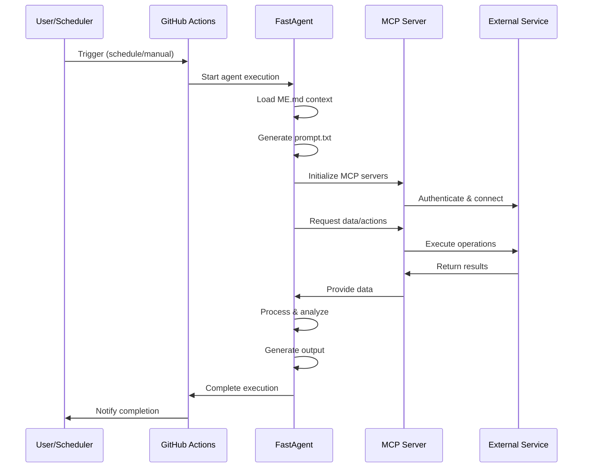
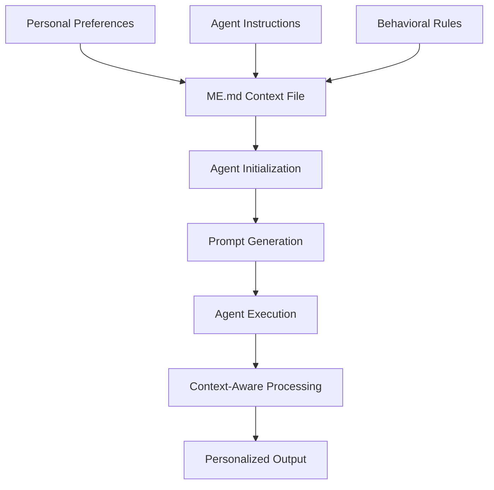
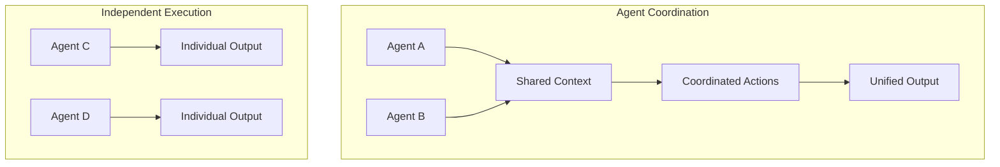

# pAI Architecture Overview

This document provides a comprehensive overview of the pAI system architecture, including core components, data flow, and integration patterns.

## System Architecture

```
┌─────────────────────────────────────────────────────────────────┐
│                        pAI System                               │
├─────────────────────────────────────────────────────────────────┤
│  ┌─────────────────┐    ┌─────────────────┐                    │
│  │    @Home        │    │     @Work       │                    │
│  │   Context       │    │   Context       │                    │
│  │                 │    │                 │                    │
│  │  ┌───────────┐  │    │  ┌───────────┐  │                    │
│  │  │gmail-     │  │    │  │pr-diff-   │  │                    │
│  │  │curator    │  │    │  │auditor    │  │                    │
│  │  └───────────┘  │    │  └───────────┘  │                    │
│  │                 │    │                 │                    │
│  │  ┌───────────┐  │    │  ┌───────────┐  │                    │
│  │  │gmail-     │  │    │  │test-      │  │                    │
│  │  │newsletter │  │    │  │coverage   │  │                    │
│  │  └───────────┘  │    │  └───────────┘  │                    │
│  └─────────────────┘    └─────────────────┘                    │
│                                                                 │
│  ┌─────────────────────────────────────────────────────────────┤
│  │                Core Framework                               │
│  ├─────────────────────────────────────────────────────────────┤
│  │  ┌─────────────┐ ┌─────────────┐ ┌─────────────┐          │
│  │  │ FastAgent   │ │ GitHub      │ │ Taskfile    │          │
│  │  │ Framework   │ │ Actions     │ │ Runner      │          │
│  │  └─────────────┘ └─────────────┘ └─────────────┘          │
│  │                                                            │
│  │  ┌─────────────────────────────────────────────────────────┤
│  │  │                MCP Protocol                             │
│  │  ├─────────────────────────────────────────────────────────┤
│  │  │  ┌─────────┐ ┌─────────┐ ┌─────────┐ ┌─────────┐      │
│  │  │  │ Gmail   │ │ Fetch   │ │ File    │ │ Custom  │      │
│  │  │  │ Server  │ │ Server  │ │ Server  │ │ Servers │      │
│  │  │  └─────────┘ └─────────┘ └─────────┘ └─────────┘      │
│  │  └─────────────────────────────────────────────────────────┘
│  └─────────────────────────────────────────────────────────────┘
│                                                                 │
│  ┌─────────────────────────────────────────────────────────────┤
│  │                External Services                            │
│  ├─────────────────────────────────────────────────────────────┤
│  │  ┌─────────┐ ┌─────────┐ ┌─────────┐ ┌─────────┐          │
│  │  │ OpenAI  │ │ Gmail   │ │ GitHub  │ │ Web     │          │
│  │  │ API     │ │ API     │ │ API     │ │ APIs    │          │
│  │  └─────────┘ └─────────┘ └─────────┘ └─────────┘          │
│  └─────────────────────────────────────────────────────────────┘
└─────────────────────────────────────────────────────────────────┘
```

## Core Components

### 1. Context Organization

The pAI system organizes agents into contexts based on their purpose:

#### @Home Context
- **Purpose**: Personal life automation
- **Agents**: gmail-curator, gmail-newsletter, test-agent
- **Characteristics**: 
  - Personal priorities and preferences
  - Informal communication style
  - Focus on life optimization

#### @Work Context
- **Purpose**: Professional workflow enhancement
- **Agents**: pr-diff-auditor, test-coverage-advisor
- **Characteristics**:
  - Professional standards and practices
  - Formal communication style
  - Focus on productivity and quality

### 2. Agent Architecture

Each agent follows a consistent structure:

```
agent-name/
├── Agentfile              # Configuration and metadata
├── Taskfile.yml           # Development and operational tasks
├── README.md              # Documentation
└── agent/                 # Core implementation
    ├── agent.py           # Main FastAgent application
    ├── fastagent.config.yaml  # MCP server configurations
    ├── prompt.txt         # Generated from ME.md
    └── output/            # Generated results
```

### 3. FastAgent Framework

FastAgent provides the core runtime for agents:

```python
@fast.agent(
    name="agent-name",
    instruction="Core agent instruction",
    servers=["gmail", "fetch"],
    model="gpt-4",
    temperature=0.3
)
async def main() -> None:
    # Agent logic here
    pass
```

#### Key Features:
- **Minimal Boilerplate**: Simple decorator-based configuration
- **Async/Await Support**: Non-blocking operations
- **MCP Integration**: Seamless external service access
- **Model Flexibility**: Support for different LLMs
- **Built-in Testing**: Testing utilities and patterns

### 4. MCP (Model Context Protocol)

MCP provides standardized access to external services:

```yaml
mcp:
  servers:
    gmail:
      transport: stdio
      command: npx
      args: [-y, '@gongrzhe/server-gmail-autoauth-mcp']
    
    fetch:
      transport: stdio  
      command: npx
      args: [-y, '@modelcontextprotocol/server-fetch']
```

#### Available MCP Servers:
- **Gmail**: Email access and management
- **Fetch**: HTTP requests and web scraping
- **Filesystem**: File system operations
- **Custom**: Domain-specific integrations

### 5. GitHub Actions Runtime

GitHub Actions provides the execution environment:

```yaml
name: Agent Workflow

on:
  schedule:
    - cron: '0 8 * * *'  # Daily at 8 AM
  workflow_dispatch:

jobs:
  run-agent:
    runs-on: ubuntu-latest
    steps:
      - uses: actions/checkout@v4
      - name: Run Agent
        run: |
          cd @Home/gmail-curator
          task run
```

#### Benefits:
- **Serverless Execution**: No infrastructure management
- **Scheduling**: Cron-based automation
- **Audit Trail**: Complete execution history
- **Secrets Management**: Secure credential handling

## Data Flow Architecture

### 1. Agent Execution Flow



### 2. Context Management Flow



### 3. Multi-Agent Coordination



## Integration Patterns

### 1. Service Integration

#### Gmail Integration
```python
# Gmail access through MCP
@fast.agent(servers=["gmail"])
async def email_agent() -> None:
    # Agent automatically has access to Gmail operations
    emails = await get_recent_emails()
    important = await filter_important_emails(emails)
    await generate_summary(important)
```

#### Web API Integration
```python
# External API access through Fetch MCP
@fast.agent(servers=["fetch"])
async def web_agent() -> None:
    # Agent can make HTTP requests
    response = await fetch_url("https://api.example.com/data")
    data = await process_response(response)
    await save_results(data)
```

### 2. Security Architecture

#### Credential Management
```
┌─────────────────────────────────────────────────────────────────┐
│                    Security Layer                               │
├─────────────────────────────────────────────────────────────────┤
│  ┌─────────────────┐    ┌─────────────────┐                    │
│  │ GitHub Secrets  │    │ Local Env Vars  │                    │
│  │                 │    │                 │                    │
│  │ • OPENAI_API_KEY│    │ • Development   │                    │
│  │ • GMAIL_CREDS   │    │ • Testing       │                    │
│  │ • CUSTOM_KEYS   │    │ • Local Runs    │                    │
│  └─────────────────┘    └─────────────────┘                    │
│                                                                 │
│  ┌─────────────────────────────────────────────────────────────┤
│  │                MCP Security                                 │
│  ├─────────────────────────────────────────────────────────────┤
│  │  • Credential isolation per server                         │
│  │  • Scoped permissions                                      │
│  │  • Audit logging                                           │
│  │  • Secure transport                                        │
│  └─────────────────────────────────────────────────────────────┘
└─────────────────────────────────────────────────────────────────┘
```

#### Permission Model
- **Principle of Least Privilege**: Agents only get necessary permissions
- **Scoped Access**: Each MCP server has limited scope
- **Audit Trail**: All actions are logged
- **Secure Storage**: Credentials stored in GitHub Secrets

### 3. Deployment Architecture

#### Local Development
```
Developer Machine
├── pAI Repository
├── Agent Development
├── Local Testing
└── Configuration
```

#### Production Deployment
```
GitHub Actions
├── Scheduled Execution
├── Secure Credential Access
├── Distributed Execution
└── Audit & Monitoring
```

## Performance Considerations

### 1. Execution Efficiency

#### Async Operations
- All I/O operations use async/await
- Concurrent execution where possible
- Non-blocking MCP server communication

#### Resource Management
- Minimal memory footprint
- Efficient token usage
- Optimized API calls

### 2. Cost Optimization

#### Token Management
```python
# Efficient prompt design
instruction = """
Brief, focused instruction that minimizes token usage
while maintaining clarity and effectiveness.
"""

# Context-aware processing
context = load_relevant_context_only()
```

#### API Call Optimization
- Batch operations where possible
- Cache frequently accessed data
- Use appropriate model sizes

### 3. Scalability Patterns

#### Horizontal Scaling
- Independent agent execution
- Parallel processing capabilities
- Distributed across GitHub Actions

#### Vertical Scaling
- Efficient resource utilization
- Optimized agent logic
- Minimal dependency overhead

## Monitoring and Observability

### 1. Execution Monitoring

```python
# Built-in logging
import logging

logger = logging.getLogger(__name__)

@fast.agent(...)
async def main() -> None:
    logger.info("Agent execution started")
    
    try:
        results = await process_data()
        logger.info(f"Processed {len(results)} items")
        
    except Exception as e:
        logger.error(f"Agent failed: {e}")
        raise
```

### 2. Output Tracking

#### Structured Output
```python
# Standardized output format
output = {
    "timestamp": datetime.utcnow().isoformat(),
    "agent": "gmail-curator",
    "status": "success",
    "metrics": {
        "emails_processed": 15,
        "important_emails": 3,
        "execution_time": 45.2
    },
    "results": [...]
}
```

#### Audit Trail
- All agent executions logged
- Complete input/output history
- Error tracking and analysis

### 3. Health Monitoring

#### System Health
- Agent execution success rates
- MCP server connectivity
- API response times

#### Performance Metrics
- Token usage per agent
- Execution duration
- Resource utilization

## Future Architecture Considerations

### 1. Multi-Agent Coordination

#### Shared Context
```python
# Future: Shared context between agents
@fast.agent(shared_context=True)
async def coordinated_agent() -> None:
    # Access shared agent state
    shared_data = await get_shared_context()
    
    # Update shared context
    await update_shared_context(results)
```

#### Agent Communication
- Inter-agent messaging
- Workflow coordination
- Dependency management

### 2. Advanced Integrations

#### Custom MCP Servers
- Domain-specific integrations
- Enterprise system connections
- Advanced workflow tools

#### AI Model Evolution
- Support for newer models
- Multi-modal capabilities
- Specialized model selection

### 3. Enhanced Security

#### Zero-Trust Architecture
- Enhanced credential management
- Runtime security monitoring
- Automated security scanning

#### Privacy Controls
- Data minimization
- Consent management
- Audit compliance

## Best Practices

### 1. Agent Design

#### Single Responsibility
- Each agent has one clear purpose
- Focused functionality
- Clear input/output contracts

#### Context Awareness
- Utilize ME.md context effectively
- Personalize agent behavior
- Maintain user preferences

### 2. Integration Patterns

#### Idempotent Operations
- Safe to retry operations
- Consistent results
- Error recovery

#### Graceful Degradation
- Handle service failures
- Provide fallback options
- Maintain core functionality

### 3. Operational Excellence

#### Documentation
- Clear agent documentation
- Usage instructions
- Troubleshooting guides

#### Testing
- Unit tests for agent logic
- Integration tests for MCP servers
- End-to-end workflow tests

## Conclusion

The pAI architecture provides a robust, scalable foundation for personal AI agent development. By leveraging FastAgent, MCP, and GitHub Actions, the system delivers:

- **Simplicity**: Easy agent development and deployment
- **Flexibility**: Support for diverse use cases and integrations
- **Security**: Robust credential management and access controls
- **Scalability**: Efficient execution and resource utilization
- **Maintainability**: Clear patterns and documentation

This architecture enables individuals to build and deploy personal AI agents that understand their context, automate their workflows, and enhance their productivity while maintaining security and auditability.