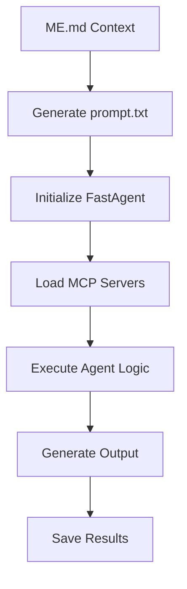

# Agent Development Guide

This comprehensive guide will teach you how to create, develop, and deploy pAI agents using the FastAgent framework.

## Table of Contents

1. [Agent Architecture Overview](#agent-architecture-overview)
2. [Setting Up Development Environment](#setting-up-development-environment)
3. [Creating Your First Agent](#creating-your-first-agent)
4. [Agent Components Deep Dive](#agent-components-deep-dive)
5. [Testing and Debugging](#testing-and-debugging)
6. [Deployment Strategies](#deployment-strategies)
7. [Best Practices](#best-practices)
8. [Advanced Patterns](#advanced-patterns)

## Agent Architecture Overview

### Core Components

Every pAI agent consists of:

```
agent-name/
├── Agentfile              # Agent configuration (FastAgent/Docker)
├── Taskfile.yml           # Development and operational tasks
├── README.md              # Agent documentation
└── agent/                 # Core implementation
    ├── agent.py           # Main FastAgent application
    ├── fastagent.config.yaml  # MCP server configurations
    └── prompt.txt         # Generated from parent ME.md
```

### Agent Lifecycle



## Setting Up Development Environment

### Prerequisites

Ensure you have completed the [Prerequisites Checklist](../getting-started/prerequisites.md).

### Development Tools

```bash
# Install development dependencies
npm install -g agentman
pip install fastapi uvicorn

# Install optional tools
npm install -g @anthropic/claude-cli  # For Claude integration
```

### Project Structure

```bash
# Clone the repository
git clone https://github.com/o3-cloud/pAI.git
cd pAI

# Set up environment
cp .env.example .env
# Edit .env with your API keys
```

## Creating Your First Agent

### Step 1: Choose Your Context

Decide whether your agent belongs in:
- `@Home/` - Personal life automation
- `@Work/` - Professional workflow enhancement

### Step 2: Create Agent Directory

```bash
# For a home agent
cd @Home
mkdir my-new-agent
cd my-new-agent

# For a work agent
cd @Work
mkdir my-new-agent
cd my-new-agent
```

### Step 3: Create the Agentfile

```dockerfile
# Agentfile
FROM agentman/base:latest

# Agent metadata
LABEL name="my-new-agent"
LABEL version="1.0.0"
LABEL description="Description of what this agent does"

# Environment variables
ENV OPENAI_API_KEY=$OPENAI_API_KEY
ENV INSTRUCTION="Your agent's core instruction here"
ENV MODEL="gpt-4"
ENV TEMPERATURE="0.3"

# MCP servers (if needed)
ENV MCP_SERVERS="gmail,fetch"

# Working directory
WORKDIR /app

# Copy agent files
COPY agent/ ./agent/
COPY Taskfile.yml ./

# Default command
CMD ["task", "agent"]
```

### Step 4: Create the Taskfile

```yaml
# Taskfile.yml
version: 3

tasks:
  prompt:
    desc: "Generate prompt.txt from ME.md"
    cmds:
      - cat ../ME.md > agent/prompt.txt
    
  agent:
    desc: "Run the agent"
    cmds:
      - agentman run --rm -e OPENAI_API_KEY=$OPENAI_API_KEY --from-agentfile -f Agentfile
    
  run:
    desc: "Run complete agent workflow"
    deps:
      - prompt
      - agent
    
  test:
    desc: "Run agent tests"
    cmds:
      - python -m pytest agent/tests/
    
  lint:
    desc: "Lint agent code"
    cmds:
      - python -m flake8 agent/
      - python -m black --check agent/
    
  format:
    desc: "Format agent code"
    cmds:
      - python -m black agent/
```

### Step 5: Create the Agent Implementation

```python
# agent/agent.py
import asyncio
from typing import Dict, Any, List
import fast

@fast.agent(
    name="my-new-agent",
    instruction="""
    Your agent's detailed instructions here.
    Be specific about what the agent should do,
    how it should behave, and what outputs to generate.
    """,
    servers=["gmail", "fetch"],  # MCP servers to use
    model="gpt-4"
)
async def main() -> None:
    """
    Main agent execution function.
    This is where your agent's logic goes.
    """
    
    # Agent implementation here
    print("🤖 Starting My New Agent...")
    
    # Example: Process some data
    results = await process_data()
    
    # Example: Generate output
    await generate_output(results)
    
    print("✅ Agent execution completed")

async def process_data() -> Dict[str, Any]:
    """
    Process data according to agent's purpose.
    """
    # Your data processing logic here
    return {"status": "success", "data": []}

async def generate_output(results: Dict[str, Any]) -> None:
    """
    Generate and save agent output.
    """
    # Create output directory
    import os
    os.makedirs("output", exist_ok=True)
    
    # Save results
    import json
    with open("output/results.json", "w") as f:
        json.dump(results, f, indent=2)
    
    # Generate human-readable summary
    with open("output/summary.txt", "w") as f:
        f.write("=== Agent Summary ===\n")
        f.write(f"Status: {results['status']}\n")
        f.write(f"Items processed: {len(results['data'])}\n")

if __name__ == "__main__":
    asyncio.run(main())
```

### Step 6: Create MCP Configuration

```yaml
# agent/fastagent.config.yaml
mcp:
  servers:
    gmail:
      transport: stdio
      command: npx
      args:
        - -y
        - '@gongrzhe/server-gmail-autoauth-mcp'
    
    fetch:
      transport: stdio
      command: npx
      args:
        - -y
        - '@modelcontextprotocol/server-fetch'
```

### Step 7: Create Agent Documentation

```markdown
# My New Agent

Brief description of what this agent does.

## Purpose

Detailed explanation of the agent's purpose and use cases.

## Prerequisites

- OpenAI API key
- Any specific requirements for this agent

## Configuration

How to configure the agent for different use cases.

## Usage

```bash
cd @Home/my-new-agent  # or @Work/my-new-agent
task run
```

## Output

Description of what the agent outputs and where to find it.

## Customization

How to customize the agent's behavior.

## Troubleshooting

Common issues and solutions.
```

## Agent Components Deep Dive

### FastAgent Framework

FastAgent provides the core agent runtime:

```python
# Basic agent structure
@fast.agent(
    name="agent-name",           # Unique identifier
    instruction="...",           # Core instruction
    servers=["server1", "server2"], # MCP servers
    model="gpt-4",              # LLM model
    temperature=0.3,            # Model temperature
    max_tokens=1000,            # Max response tokens
    tools=[],                   # Custom tools
    memory=True,                # Enable memory
    stream=False                # Stream responses
)
async def main() -> None:
    # Agent logic here
    pass
```

### MCP Server Integration

MCP servers provide external service integration:

```yaml
# Common MCP servers
mcp:
  servers:
    gmail:
      transport: stdio
      command: npx
      args: [-y, '@gongrzhe/server-gmail-autoauth-mcp']
    
    fetch:
      transport: stdio
      command: npx
      args: [-y, '@modelcontextprotocol/server-fetch']
    
    filesystem:
      transport: stdio
      command: npx
      args: [-y, '@modelcontextprotocol/server-filesystem']
```

### Context Management

The `ME.md` file provides personal context:

```markdown
# Context Template

## Personal Information
- Name: [Your name]
- Role: [Your role]
- Preferences: [Your preferences]

## Agent Behavior
- Tone: [Communication style]
- Detail Level: [How detailed responses should be]
- Priorities: [What to focus on]

## Specific Instructions
- [Agent-specific guidance]
- [Custom rules or constraints]
```

## Testing and Debugging

### Unit Testing

```python
# agent/tests/test_agent.py
import pytest
from unittest.mock import patch, AsyncMock
from agent.agent import main, process_data

@pytest.mark.asyncio
async def test_process_data():
    """Test data processing function."""
    result = await process_data()
    assert result["status"] == "success"
    assert isinstance(result["data"], list)

@pytest.mark.asyncio
async def test_main_execution():
    """Test main agent execution."""
    with patch("agent.agent.process_data") as mock_process:
        mock_process.return_value = {"status": "success", "data": []}
        
        # Should not raise exceptions
        await main()

@pytest.fixture
def mock_mcp_servers():
    """Mock MCP servers for testing."""
    with patch("fast.agent") as mock_agent:
        yield mock_agent
```

### Integration Testing

```python
# agent/tests/test_integration.py
import pytest
import os
import tempfile
from agent.agent import main

@pytest.mark.asyncio
async def test_full_agent_execution():
    """Test complete agent execution."""
    with tempfile.TemporaryDirectory() as tmpdir:
        os.chdir(tmpdir)
        
        # Create test environment
        os.makedirs("output", exist_ok=True)
        
        # Run agent
        await main()
        
        # Verify outputs
        assert os.path.exists("output/results.json")
        assert os.path.exists("output/summary.txt")
```

### Debugging Techniques

```python
# Add logging to your agent
import logging

logging.basicConfig(level=logging.DEBUG)
logger = logging.getLogger(__name__)

@fast.agent(...)
async def main() -> None:
    logger.info("Agent starting...")
    
    try:
        results = await process_data()
        logger.info(f"Processed {len(results['data'])} items")
        
        await generate_output(results)
        logger.info("Output generated successfully")
        
    except Exception as e:
        logger.error(f"Agent execution failed: {e}")
        raise
```

### Local Testing

```bash
# Run agent in development mode
export OPENAI_API_KEY="your-key"
export DEBUG=1

# Test individual components
task prompt
task agent

# Run with verbose output
task run --verbose

# Test with mock data
export MOCK_DATA=1
task run
```

## Deployment Strategies

### GitHub Actions Deployment

Create a workflow file:

```yaml
# .github/workflows/my-new-agent.yml
name: My New Agent

on:
  schedule:
    - cron: '0 8 * * *'  # Daily at 8 AM
  workflow_dispatch:

jobs:
  run-agent:
    runs-on: ubuntu-latest
    steps:
      - name: Checkout code
        uses: actions/checkout@v4
        
      - name: Setup Node.js
        uses: actions/setup-node@v4
        with:
          node-version: '18'
          
      - name: Install dependencies
        run: |
          npm install -g agentman
          curl -sL https://taskfile.dev/install.sh | sh
          
      - name: Setup credentials
        env:
          GMAIL_CREDENTIALS: ${{ secrets.GMAIL_CREDENTIALS_JSON }}
        run: |
          mkdir -p ~/.gmail-mcp
          echo "$GMAIL_CREDENTIALS" > ~/.gmail-mcp/credentials.json
          
      - name: Run agent
        env:
          OPENAI_API_KEY: ${{ secrets.OPENAI_API_KEY }}
        run: |
          cd @Home/my-new-agent  # or @Work/my-new-agent
          task run
```

### Docker Deployment

```dockerfile
# Dockerfile
FROM node:18-alpine

# Install system dependencies
RUN apk add --no-cache python3 py3-pip

# Install global tools
RUN npm install -g agentman

# Set working directory
WORKDIR /app

# Copy agent files
COPY . .

# Install dependencies
RUN npm install

# Run agent
CMD ["task", "run"]
```

### Local Scheduling

```bash
# Add to crontab for local scheduling
crontab -e

# Add line for daily execution at 8 AM
0 8 * * * cd /path/to/pAI/@Home/my-new-agent && task run
```

## Best Practices

### Code Organization

```python
# agent/agent.py - Main agent logic
# agent/core.py - Core business logic
# agent/utils.py - Utility functions
# agent/config.py - Configuration management
# agent/models.py - Data models
# agent/tests/ - Test files
```

### Error Handling

```python
@fast.agent(...)
async def main() -> None:
    try:
        # Main agent logic
        results = await process_data()
        await generate_output(results)
        
    except Exception as e:
        # Log error
        logger.error(f"Agent failed: {e}")
        
        # Generate error report
        await generate_error_output(e)
        
        # Re-raise for visibility
        raise
```

### Configuration Management

```python
# agent/config.py
import os
from dataclasses import dataclass
from typing import Optional

@dataclass
class AgentConfig:
    model: str = "gpt-4"
    temperature: float = 0.3
    max_tokens: int = 1000
    debug: bool = False
    
    @classmethod
    def from_env(cls) -> "AgentConfig":
        return cls(
            model=os.getenv("MODEL", "gpt-4"),
            temperature=float(os.getenv("TEMPERATURE", "0.3")),
            max_tokens=int(os.getenv("MAX_TOKENS", "1000")),
            debug=os.getenv("DEBUG", "").lower() == "true"
        )
```

### Output Management

```python
# agent/outputs.py
import json
import os
from datetime import datetime
from typing import Dict, Any

class OutputManager:
    def __init__(self, output_dir: str = "output"):
        self.output_dir = output_dir
        os.makedirs(output_dir, exist_ok=True)
        
    def save_json(self, data: Dict[str, Any], filename: str) -> None:
        """Save data as JSON with timestamp."""
        filepath = os.path.join(self.output_dir, filename)
        with open(filepath, "w") as f:
            json.dump({
                "timestamp": datetime.utcnow().isoformat(),
                "data": data
            }, f, indent=2)
    
    def save_text(self, content: str, filename: str) -> None:
        """Save text content with timestamp."""
        filepath = os.path.join(self.output_dir, filename)
        with open(filepath, "w") as f:
            f.write(f"Generated: {datetime.utcnow().isoformat()}\n")
            f.write("=" * 50 + "\n\n")
            f.write(content)
```

## Advanced Patterns

### Multi-Agent Coordination

```python
# agent/coordinator.py
import asyncio
from typing import List, Dict, Any

class AgentCoordinator:
    def __init__(self, agents: List[str]):
        self.agents = agents
        
    async def run_parallel(self) -> Dict[str, Any]:
        """Run multiple agents in parallel."""
        tasks = []
        for agent in self.agents:
            task = asyncio.create_task(self.run_agent(agent))
            tasks.append(task)
        
        results = await asyncio.gather(*tasks)
        return dict(zip(self.agents, results))
    
    async def run_sequential(self) -> Dict[str, Any]:
        """Run agents sequentially, passing results."""
        results = {}
        context = {}
        
        for agent in self.agents:
            result = await self.run_agent(agent, context)
            results[agent] = result
            context.update(result)
        
        return results
```

### Custom Tools Integration

```python
# agent/tools.py
from typing import Dict, Any

def create_custom_tool(name: str, description: str, function):
    """Create a custom tool for the agent."""
    return {
        "name": name,
        "description": description,
        "function": function
    }

async def web_search(query: str) -> Dict[str, Any]:
    """Custom web search tool."""
    # Implementation here
    return {"results": []}

# Use in agent
@fast.agent(
    tools=[
        create_custom_tool("web_search", "Search the web", web_search)
    ]
)
async def main() -> None:
    # Agent can now use web_search tool
    pass
```

### Memory and State Management

```python
# agent/memory.py
import json
import os
from typing import Dict, Any, Optional

class AgentMemory:
    def __init__(self, memory_file: str = "agent_memory.json"):
        self.memory_file = memory_file
        self.memory = self.load_memory()
    
    def load_memory(self) -> Dict[str, Any]:
        """Load memory from file."""
        if os.path.exists(self.memory_file):
            with open(self.memory_file, "r") as f:
                return json.load(f)
        return {}
    
    def save_memory(self) -> None:
        """Save memory to file."""
        with open(self.memory_file, "w") as f:
            json.dump(self.memory, f, indent=2)
    
    def remember(self, key: str, value: Any) -> None:
        """Store a memory."""
        self.memory[key] = value
        self.save_memory()
    
    def recall(self, key: str) -> Optional[Any]:
        """Retrieve a memory."""
        return self.memory.get(key)
```

## Common Patterns

### Email Processing Agent

```python
@fast.agent(
    name="email-processor",
    instruction="Process emails according to user priorities",
    servers=["gmail"],
    model="gpt-4"
)
async def main() -> None:
    # Get recent emails
    emails = await get_recent_emails()
    
    # Filter and prioritize
    important_emails = await filter_important(emails)
    
    # Generate summaries
    summaries = await generate_summaries(important_emails)
    
    # Save output
    await save_email_report(summaries)
```

### Data Analysis Agent

```python
@fast.agent(
    name="data-analyzer",
    instruction="Analyze data and generate insights",
    servers=["filesystem", "fetch"],
    model="gpt-4"
)
async def main() -> None:
    # Load data
    data = await load_data_sources()
    
    # Analyze patterns
    insights = await analyze_patterns(data)
    
    # Generate visualizations
    charts = await create_visualizations(insights)
    
    # Create report
    await generate_analysis_report(insights, charts)
```

### Notification Agent

```python
@fast.agent(
    name="notifier",
    instruction="Send notifications based on conditions",
    servers=["slack", "email"],
    model="gpt-4"
)
async def main() -> None:
    # Check conditions
    alerts = await check_alert_conditions()
    
    # Generate notifications
    notifications = await create_notifications(alerts)
    
    # Send notifications
    await send_notifications(notifications)
```

## Troubleshooting

### Common Issues

1. **Agent fails to start**
   - Check environment variables
   - Verify MCP server configurations
   - Review agent logs

2. **MCP server connection failures**
   - Verify server installation
   - Check network connectivity
   - Review server logs

3. **Unexpected outputs**
   - Review agent instructions
   - Check input data quality
   - Adjust model parameters

### Debugging Commands

```bash
# Check agent configuration
task lint

# Run in debug mode
DEBUG=1 task run

# Test MCP servers
npx @gongrzhe/server-gmail-autoauth-mcp --test

# View logs
cat agent/output/agent.log
```

## Next Steps

1. **Create your first agent** using this guide
2. **Study existing agents** for patterns and inspiration
3. **Join the community** to share your agents
4. **Contribute to the framework** with improvements
5. **Explore advanced features** like multi-agent coordination

## Resources

- [FastAgent Documentation](https://fast-agent.ai/docs)
- [MCP Protocol Specification](https://modelcontextprotocol.io/)
- [pAI Agent Examples](../../@Home/)
- [Community Forum](https://github.com/o3-cloud/pAI/discussions)

## Contributing

We welcome contributions to the pAI agent ecosystem:

1. **Share your agents** - Submit pull requests with new agents
2. **Improve documentation** - Help make this guide better
3. **Report issues** - Help us fix bugs and improve the platform
4. **Suggest features** - Share ideas for new capabilities